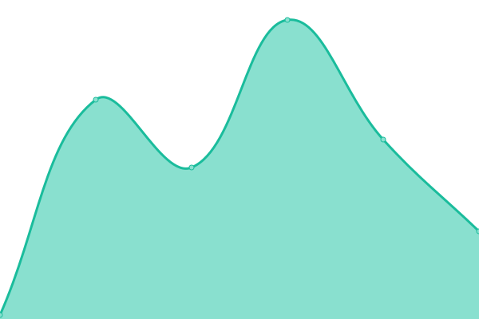

# [📈 Live Status](https://demo.upptime.js.org): <!--live status--> **🟧 Partial outage**

This repository contains the open-source uptime monitor and status page for [Tsoris](tsorisgroup.com), powered by [Upptime](https://github.com/upptime/upptime).

With [Upptime](https://upptime.js.org), you can get your own unlimited and free uptime monitor and status page, powered entirely by a GitHub repository. We use [Issues](https://github.com/tsorisgroup/upptime/issues) as incident reports, [Actions](https://github.com/tsorisgroup/upptime/actions) as uptime monitors, and [Pages](https://demo.upptime.js.org) for the status page.

<!--start: status pages-->
<!-- This summary is generated by Upptime (https://github.com/upptime/upptime) -->
<!-- Do not edit this manually, your changes will be overwritten -->
<!-- prettier-ignore -->
| URL | Status | History | Response Time | Uptime |
| --- | ------ | ------- | ------------- | ------ |
|  [Cooper Tsoris](https://tsoris.com) | 🟩 Up | [cooper-tsoris.yml](https://github.com/tsorisgroup/uptime/commits/HEAD/history/cooper-tsoris.yml) | 

 188ms
     
 | 

<a href="https://status.tsoris.com/history/cooper-tsoris">100.00%</a>
    

|  [Tsoris Group](https://corp.tsoris.com) | 🟥 Down | [tsoris-group.yml](https://github.com/tsorisgroup/uptime/commits/HEAD/history/tsoris-group.yml) | 

 53ms
     
 | 

<a href="https://status.tsoris.com/history/tsoris-group">0.00%</a>
    

|  [Content Delivery Network](https://cdn.tsoris.com/Branding/Wordmark/tsoris365.png) | 🟩 Up | [content-delivery-network.yml](https://github.com/tsorisgroup/uptime/commits/HEAD/history/content-delivery-network.yml) | 

 237ms
     
 | 

<a href="https://status.tsoris.com/history/content-delivery-network">100.00%</a>
    

<!--end: status pages-->

[**Visit our status website →**](https://demo.upptime.js.org)

## 📄 License

- Powered by: [Upptime](https://github.com/upptime/upptime)
- Code: [MIT](./LICENSE) © [Anand Chowdhary](https://anandchowdhary.com), supported by [Pabio](https://pabio.com)
- Data in the `./history` directory: [Open Database License](https://opendatacommons.org/licenses/odbl/1-0/)
